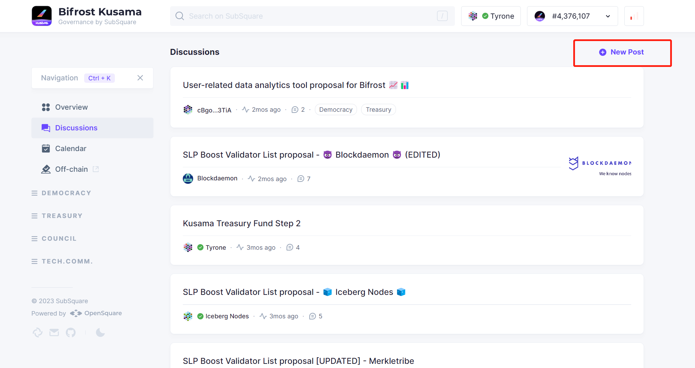

# Open Discussion

Open discussion welcomes eveyone to output their ideas about BIfrost Network, who wants to change any parameters on Bifrost parachain, so we can open discuss with the whole community, and then an on-chain proposal would have more chances to be passed.

### Start with Bifrost Forum

Propose and discuss an off-chain proposal at: [https://bifrost.subsquare.io/discussions](https://bifrost.subsquare.io/discussions)\

<figure><figcaption></figcaption></figure>

* Step 1: Sign in and log into your account so you can create a **New Post**.
* Step 2: Put your proposal **Title**.
* Step 3: Choose a **category** for which governance part you are proposing for.
* Step 4: Pick one or more **features** that your topic relate to.
* Step 5: Demonstate your proposal contents, let the community know what is the current problem, what is your suggestion, how we are going to sove it?

Here is an [example](https://bifrost.subsquare.io/post/30)
