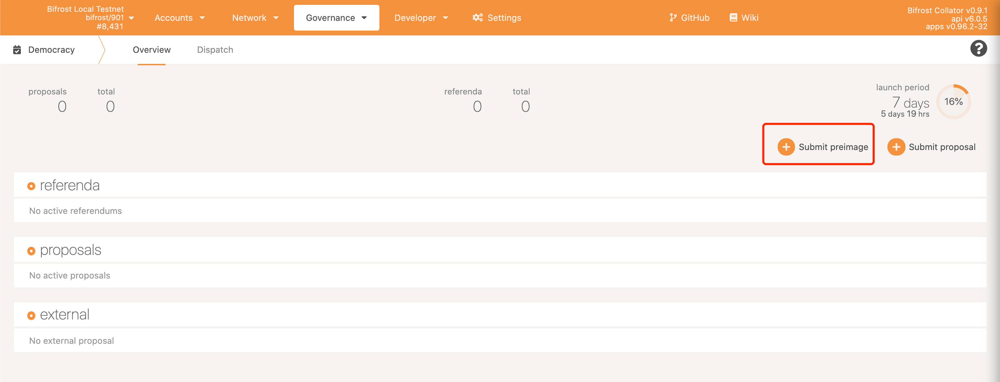
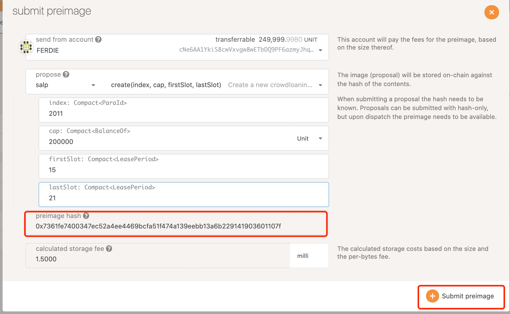
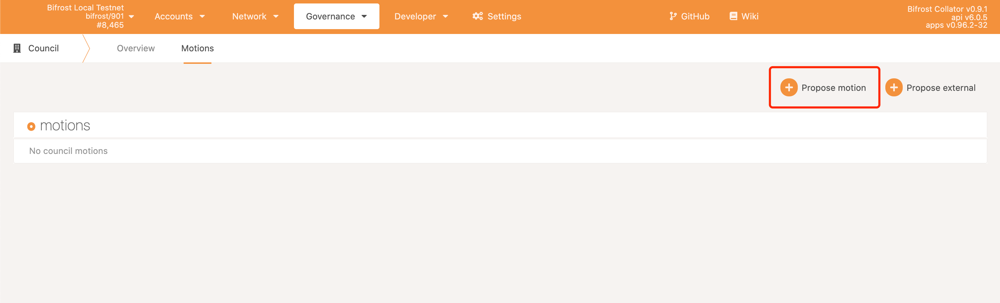
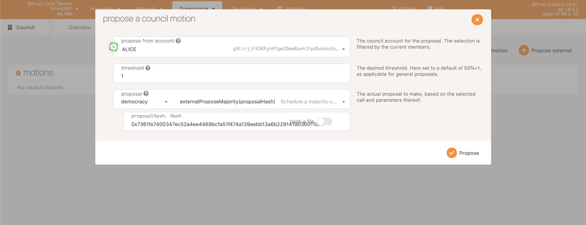
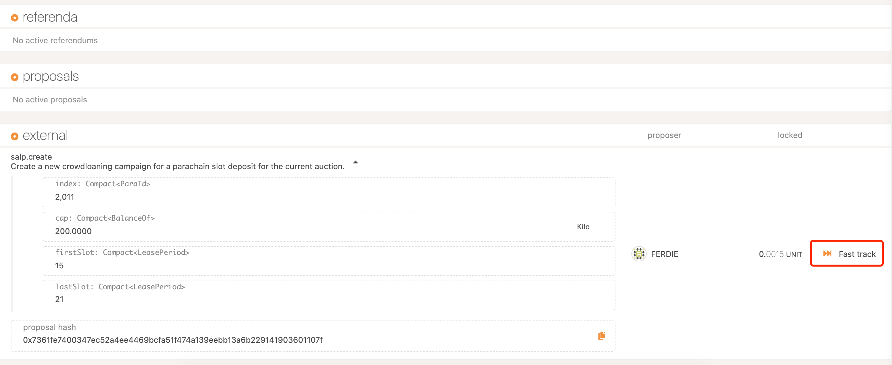
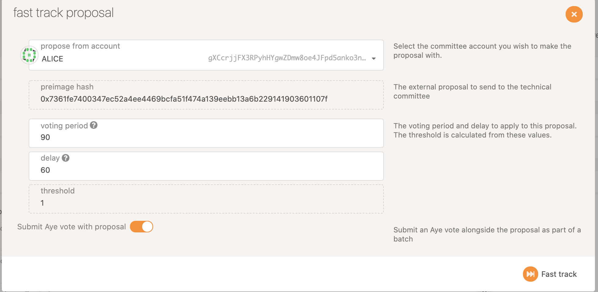

# 投票与治理细则

## 示例1：Zenlink-Asgard 治理 

Step1: 创建原像

Step2: 填入参数保存原像的 hash

Step3: 进入 council 提交 motion

Step4: 阈值请填入3人，调用 demoncracy-external proposal Majority （请注意一定是 majority，外部提案才能被技术委员会加速），提交

Step5: 全票通过该 motion

Step6: 在 demoncracy 中可找到外部提案，点击 fast track 加速

Step7: voting period 为加速后需要多少区块的投票时间，delay 为投票通过后需要等待多少区块执行。填入相应参数后点击 fast track

Step8: 在技术委员会中全票通过外部提案的加速

Step9: 等待 delay 时间结束，即可升级完成

