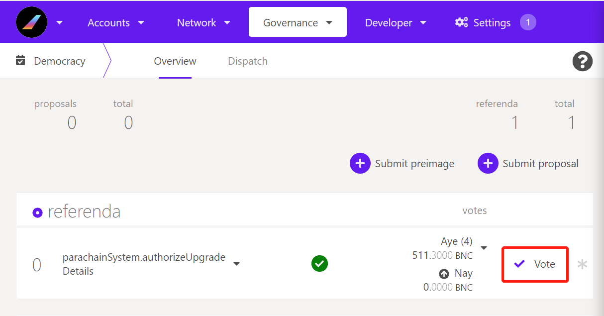
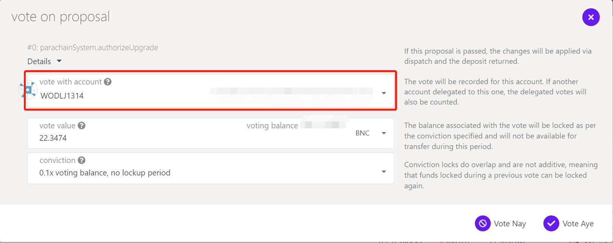
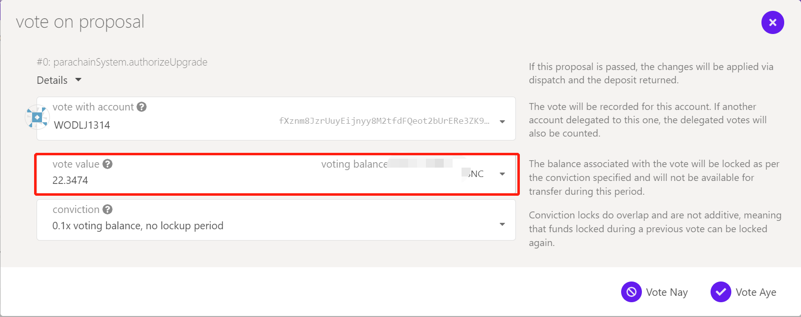
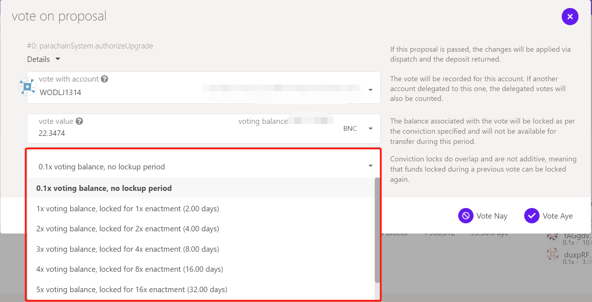
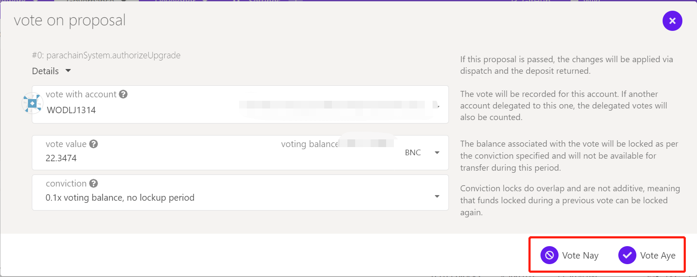

# Voting Examples

## Referendum proposal: Remove Sudo permissions

&#x20;In the previous Runtime upgrades, Bifrost used Sudo (super administrator privileges) to complete centralized governance upgrades. In this v0.8.5 version upgrade, Bifrost opened a democratic referendum for the first time to remove Sudo (super administrator privileges), and all BNC holders can participate in this voting to vote on their own attitude.&#x20;

The removal of Sudo is an important milestone in the Bifrost mainnet's path towards decentralization. After Sudo is removed, anyone can submit a proposal by staking BNC and propose an on-chain upgrade to the Bifrost network, and all BNC holders will vote to make a decision.&#x20;

In the next upgrade, Bifrost will initiate a v0.9.0 SALP upgrade proposal, which will include the launch of the SALP module and the opening of vsKSM and vsBond transfers. At that time, users will be able to participate in the liquidity bet of the Kusama parachain auction through Bifrost Dapp, casting vsKSM & vsBond.

### Referendum Content&#x20;

* Referendum name: Remove Sudo&#x20;
* End Block Height: #360,612&#x20;
* Voting period: 48 hours&#x20;
* Execution period: Instant execution of proposal&#x20;
* Hash: 0xb1c70d9475138dbba5631169582bca42ce18e3ca99830d4d9af7c44b7da62976

### How to vote 

1\. Enter Bifrost Democracy：[https://polkadot.js.org/apps/?rpc=wss%3A%2F%2Fbifrost-rpc.liebi.com%2Fws#/democracy](https://polkadot.js.org/apps/?rpc=wss%3A%2F%2Fbifrost-rpc.liebi.com%2Fws#/democracy)

2\. Vote For referenda #0

3\. Seledt the address for voting

4\. Input vote value

5\. Choose the voting weight (the longer the lockup period, the greater the voting weight. For example: lock 1 BNC and select '0.1x voting balance, no lockup period' is the amount of votes with a coefficient of 1BNC x 0.1, without locking; the lockup period for each enactment For 2 days.)

6\. Vote, Aye for support, Nay for opposition, sign and submit

### &#x20;

