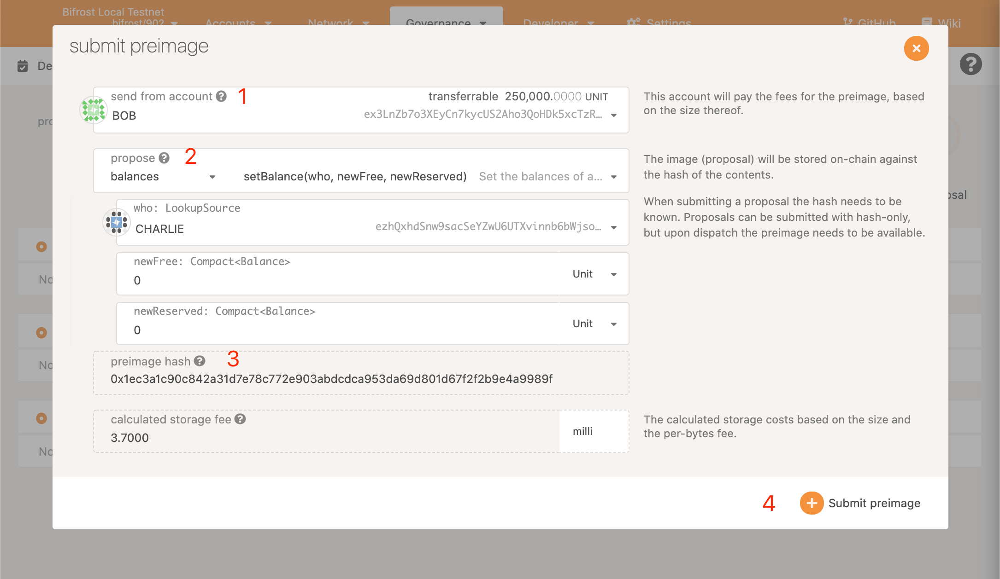
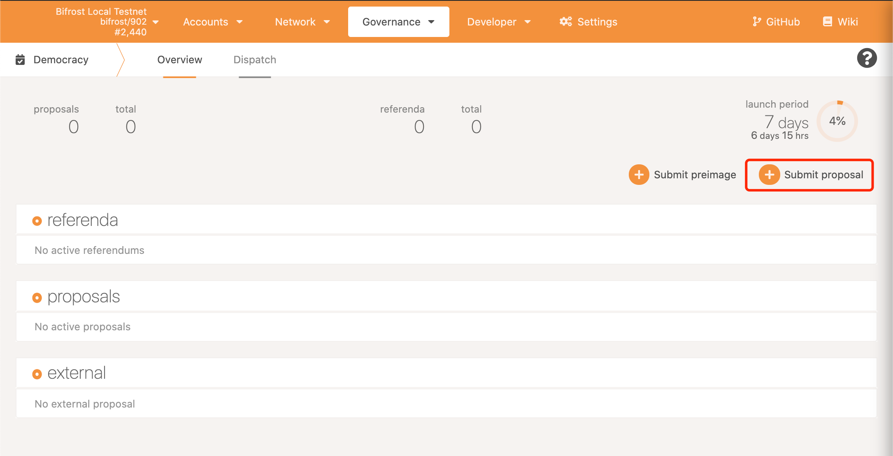
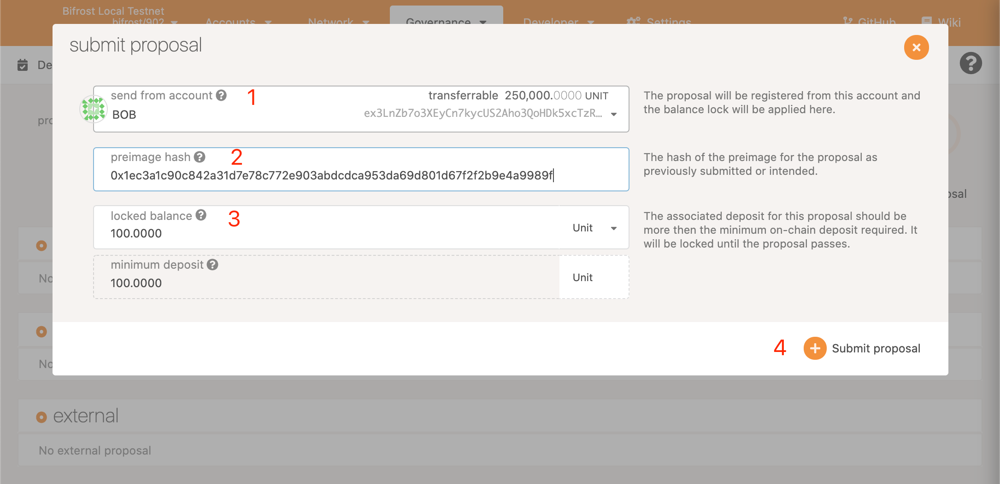

# Submit a Referendum Proposal

Go to Governance->Democracy, Click (Submit preimage）

Input Arguments

1. Select account address
2. Select Governance Content
3. Copy and Save（preimage hash）
4. Click to (Submit preimage)

Submit proposal

1. Select account address （balance should be more than  100 BNCs）
2. Input preimage hash saved before&#x20;
3. Lock 100 BNC
4. Click to (Submit proposal)
