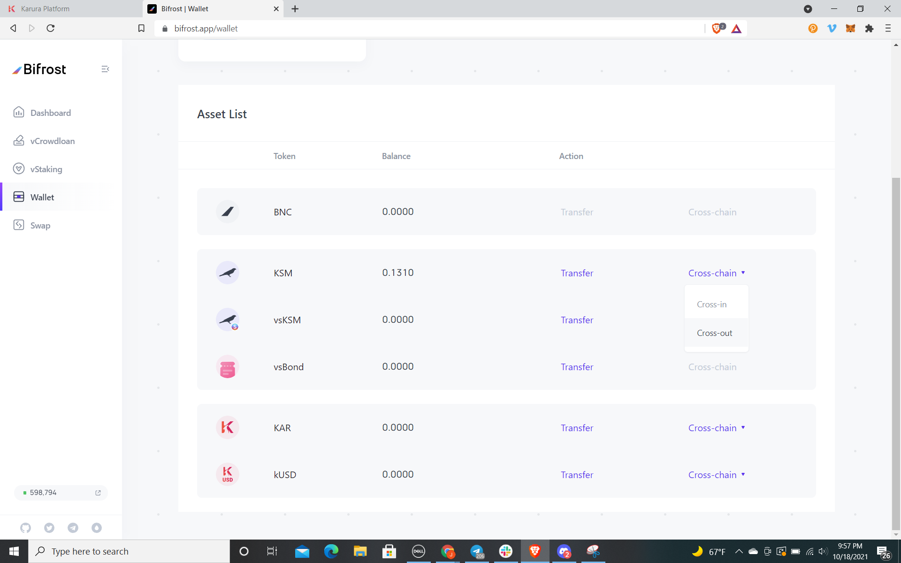
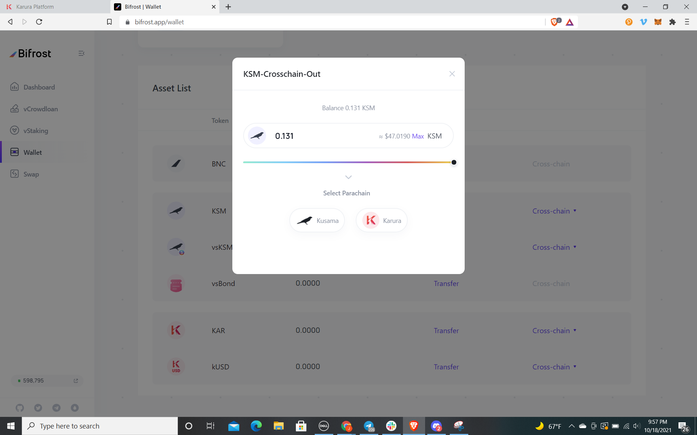
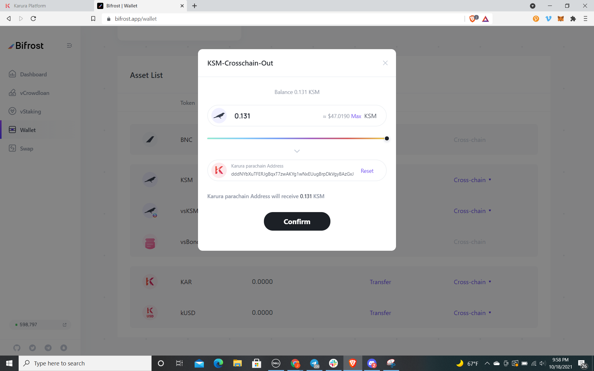
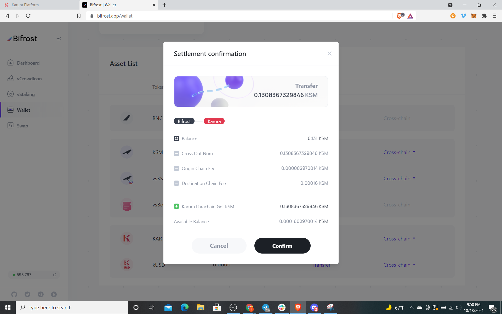

# 从 Bifrost 发送 Token 到 Karura

1\) 用Web浏览器打开 [Bifrost app](https://bifrost.app/wallet) ，点击 `Wallet` 标签，在 Asset List 页面中滚动选择需要发送的Token，点击 `Cross-chain` 下的 `Cross-out` 标签按钮；

2\) 输入您要 “Cross-Out” 的 Token 金额后选择 Karura 平行链 ([Karura Wiki](https://wiki.karura.app/general/transfer-guide/parachain-transfer-guide)) ；

3\) 从下拉列表中选择您要向其发送 Token 的帐户（请不要担心地址采用的是 Bifrost 的格式，您的资产仍将发送到 Karura 平行链上的 Karura 地址），点击 `Confirm` 按钮；

4\) 点击 “Cross-Out” 查看转出详情，检查确认相关信息无误， 点击 `Confirm` 按钮；

5\) 转账成功后，账户余额会在 Bifrost 和 Karura 两个平行链的操作界面中查看到。
