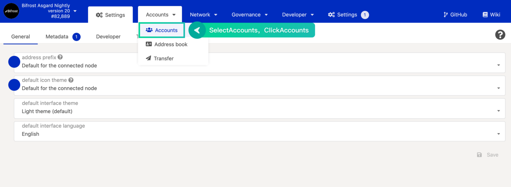
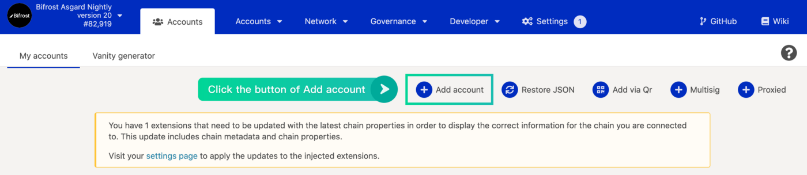
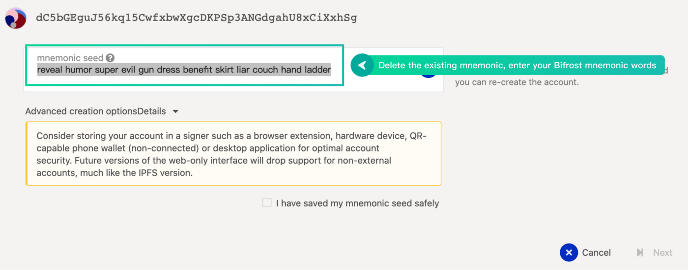
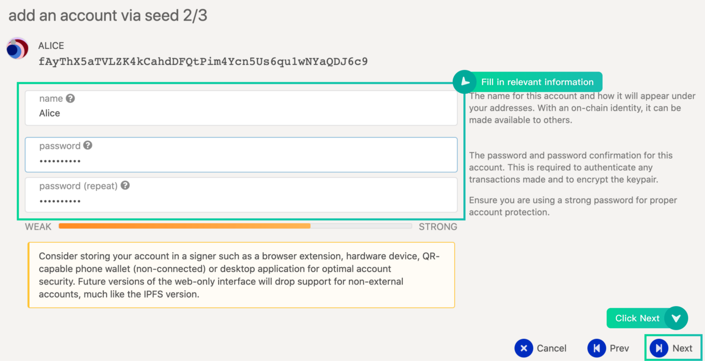

# Create BNC Account

## Step 1

Open the URL: [https://dash.bifrost.finance/\#/accounts](https://dash.bifrost.finance/#/accounts)

## Step 2

Click the button \[Add account\]

## Step 3

Write down \[mnemonic seed\], then click the button \[Next\]

## Step 4

Input account \[name\], \[pasword\], \[repeated password\]，then click the button \[Next\]

## Step 5

Click the button \[save\] to complete

## Step 6

Click the \[icon\] of the account, means to copy the \[address\]

