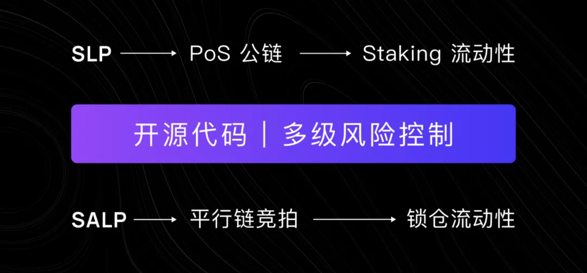

# 风险控制

Bifrost 作为波卡生态的 DeFi 基础协议，致力成为质押资产提供流动性的基础设施，对**资金安全提供有效保障**，必然是首要设计目标。为了系统化地实现这一目标，Bifrost 从多层面多级别，对各类可能出现的业务与技术风险作出分析，并给出对应的防控措施与解决方案。

### **资金跨链与铸币安全**

Bifrost 目前已设计完成的子协议，有 SLP（Staking Liquidity Protocol）和 SALP（Slot Auction Liquidity Protocol） 。

SLP 为多个知名 PoS 公链的 Staking 活动提供流动性释放。用户通过 SLP 业务进行 Staking 将获得衍生品 vToken，例如 Staking DOT 将获得 vDOT，Staking KSM 将获得 vKSM。以 DOT 为例，用户需要用私钥签名，将 DOT 转移到部署在 Bifrost 平行链上的 SLP 模块中，由 SLP 执行 Stake 操作，并向用户发放 vDOT。SLP 模块是由自动化的开源代码所控制的，任何人无法移动其中的资产，只有用户归还 vToken 并签名赎回 Trading 时，SLP 才会执行 Unstake 操作并返还用户资产。

在此过程中，衍生品的铸造和回收的安全性是由 SLP 开源代码保障的，只要代码没有漏洞，就不会有安全隐患；跨链资产转移的安全是由 XCMP 保障的，如果 SLP 业务涉及到非波卡原生资产（例如要释放 Staking ETH 的流动性），跨链资产转移还将用到桥接链。波卡官方的桥接链尚未发布，尽管如此，已经有不少经过审计的第三方桥接链供 Bifrost 选择。

SALP 为 Pokadot 生态中的平行链插槽竞拍活动提供流动性释放，用户参与 Crowdloan, 向竞拍平行链的项目投票，将获得 vsDOT/vsKSM，还有该平行链对应的 vsBond。该过程的安全模型与 SLP 业务类似。用户需要签名将 DOT/KSM 转移到部署在 Bifrost 平行链上的 SALP 模块中，由 SALP 执行投票，并向用户发 vsDOT/vsKSM和 vsBond。SALP 是一组开源的代码，只要代码没有问题，SALP 所管理的资产就是安全的。

无论是 SLP，还是 SALP，Bifrost 都没有采用常规的多签地址方案，而是采用了开源代码的协议来管理质押资产，这样做不需要依赖任何第三方来保障资产安全，代码本身就是保障。如果用多签地址来管理质押资产，势必还会涉及到让多签地址的管理者进行超额抵押来保障资金安全，这无疑是昂贵的。

### **资金承载能力与承载安全**

用户可能会有这样的顾虑：待释放流动性的质押资产规模何其庞大，Bifrost 是否能够承载？如果 BNC 的市值过小，会不会有安全隐患？这样的想法，有两个误区。其一，Bifrost 将以平行链的方式运行，而不是独立公链。

Bifrost 网络将由 Kusama/Polkadot 中继链的验证人负责验证区块，Bifrost 的安全性是托管给中继链来负责的。如果攻击者想要实施攻击，需要掌握至少 1/3 的 Staking 状态下的 DOT/KSM，而不是 BNC。其二，即便 Bifrost 所管理的质押资产达到庞大的数量，超过了 Staking KSM/DOT 市值的 1/3，攻击者也很难发起有效的破坏活动。

波卡所采用的共识机制，是 NPoS + GRANDPA + BABE 的混合共识机制，这种共识机制具备最终确定性，而不是概率确定性。因而已经形成最终确定性的交易不存在回滚的可能。攻击者无法通过篡改账本获利，最多只能做到拒绝打包新交易，影响网络的可用性，致使网络无法处理用户的相关请求，无法威胁到 Bifrost 所管理的质押资产安全。波卡的验证人选举机制已经最大程度在避免这种情况，如果当真一个或者一伙验证人掌握了 1/3 以上的 Staking DOT/KSM，那就不只是 Bifrost 要担心的事情了。

### **Staking 与 Slash 风险控制**

PoS 公链的 Staking 机制设计中，通常会内嵌 Slash 机制，以对作恶或故障节点进行惩罚。若在一次 Slash 中罚没的资金可能超过 Staking 金额的 10%，则被认为是高额罚款。Bifrost 系统一旦发现这种情况，就会立即发起 Unstake 操作，以降低再次被罚的可能性。但参投资金被 Slash 的风险仍然很大，尤其是 Polkadot 的 L4 级别 Slash，其一次性罚没的资金为 100%。所以 Bifrost 采取了这样的策略：

> Staking 票权购买者（Bidder）进行 Staking 的目标节点自身所投资金（或从社区中募集的资金），必须超过所购买的票权金额。我们称此策略为跟投策略。这意味着 Bifrost 票权市场不会成为验证人票权的主要来源。

Bifrost 实际运行时采取的参数范围，可能不操过目标节点所投资金的 ½ ～ ⅔，具体参数可由社区投票进行修改。这样才可避免目标节点故意作恶以触发高额 Slash 导致 Bifrost 平台严重受损，从经济博弈的角度来看，理智的节点不会做出自杀式攻击，系统具备经济学意义上的安全性。但为了以防万一，我们还是制定了一套应对策略。

首先，Bidder 购票时，需要支付投票额度的 10% 作为 Slash 风险保证金（大多数 Slash 的情况，金额是小于 10% 的）。举一个具体的例子：某验证人购买了 100 DOT \* 1 个月的投票权，该验证人需支付票权费用给 Bifrost 平台，并质押 10% 的 Slash 风险保证金，也就是 10 DOT。在期限内没有发生 Slash 的情况下，这 10 DOT Slash 风险保证金最终会在一个月期满时归还给该验证人。

如果委托给验证人的 Token 还是遭遇了不可预期的 Slash，导致 Bifrost 参投资金部分被罚，则启动如下处置流程：

* 首先从被罚验证人锁定的 10 DOT Slash 风险保证金中进行抵扣，并执行 Unstake。
* 若风险保证金不足以抵扣所罚资金，则从 Bifrost 平台获取的票权费用的风险防控部分中抽取资金进行补贴。
* 若仍不足以抵扣，则抽取 Bifrost 预留的系统级风险保证金进行抵扣。由于 Bifrost 预留的系统级风险保证金在理论上可能会越扣越少，需要进行补充以应对未来可能再次发生的 Slash 扣款，所以 Bifrost 设计了 Slash 后的通胀机制：在发生数额较大的 Slash 资金抵扣之后的 6 个月内，采取线性补充策略，将系统保证金逐步恢复到原始值，并停止通胀。这是 BNC 总量唯一可能进行增发或通胀的表现形式。
* 若仍不足以抵扣，则由全体 vDOT 持有者按持有额度分摊最终风险，即：用 vDOT 赎回 DOT 时，将比预期值要少一些。Bifrost 也在积极寻求第三方的去中心化保险平台接入，来承担概率小但影响大的黑天鹅级的 Slash 事件。

****
