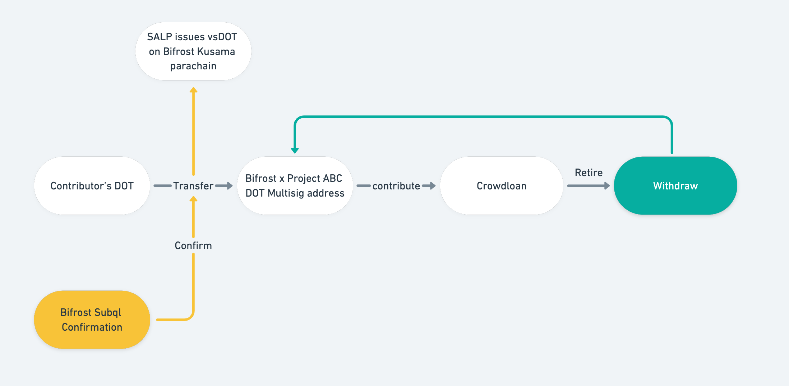
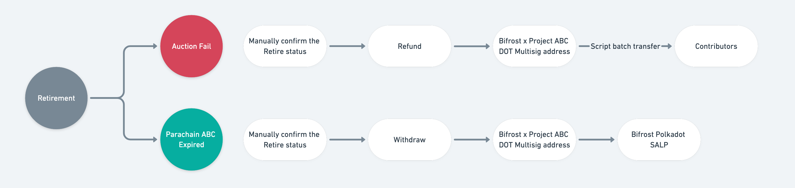
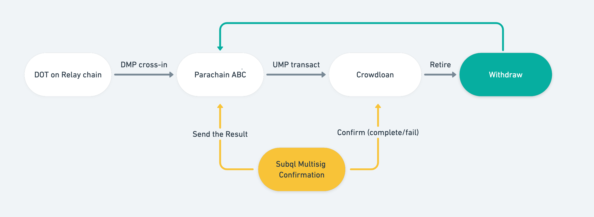

# SALP on Polkadot

SALP on Kusama 的实现分为两个阶段：在 Bifrost 成为 Kusama 平行链之前采用 **多签模式** ，在 Bifrost 成为 Kusama 平行链之后则采用 **XCM 模式** 。前者需要信任多签小组是诚实的，后者则通过去中心化的链上代码逻辑实现，没有信任假设。SALP on Polkadot 同样经历两个阶段：

#### 第一阶段：多签模式 

在 Bifrost 成为 Polkadot 平行链之前，由见证人小组管理的 [**Polkadot 中继链多签账户**](https://hackmd.io/SdVjVs-hRTedz8qahgIEYg) 来收集贡献，并通知 Bifrost 链为用户铸造衍生品资产（Derivatives），因为 Polkadot 生态和 Kusama 生态目前互不相通，Polkadot 的消息无法通过 XCM 传递到 Kusama 平台的 Bifrost 平行链。

#### Mint 流程 

**1.** 所有用户贡献的 DOT 将转入 Bifrost 在 Polkadot 端创建的（9/14）多签地址中；

**2.** Bifrost 的 Subql 多签确认服务将验证向多签地址转入 DOT 是否成功；

**3.** 由 Bifrost 端发起，多签方确认并执行多方签名，将多签地址中的 DOT 贡献至 Polkadot Crowdloan；

**4.** Bifrost 端向为用户铸造 Derivatives：vsDOT 和 vsBond。

#### Redeem 流程 

分为两种情况，分别是竞拍失败和平行链租约到期。

**竞拍失败，Crowdloan 结束**

**1.** 多签方手动确认 Crowdloan 资金的 “Retireable” 状态

**2.** 执行 “Retire”，Polkadot 退还 DOT 至多签地址

**3.** 多签方执行批量 Transfer，将 DOT 返还至用户

**拍卖成功，平行链租约到期**

**1.** 多签方手动确认 Crowdloan 资金的 “Retireable” 状态

**2.** 执行结束退休，Polkadot 退还 DOT 至 Bifrost 多签地址

**3.** 多签方执行批量 Transfer，将 DOT Transfer 至 Bifrost SALP 模块，用户凭 vsDOT + vsBond完成 DOT 的承兑

#### 第二阶段：XCM (去信任化) 

在 Bifrost 成为 Polkadot 平行链之后，Bifrost 希望实现和 SALP on Kusama 一样的 **完全的去信任化** ，全部流程通过 **链上逻辑执行** 。

但在 Bifrost 成为 Polkadot 平行链之后，还有一个因素制约着从多签到去信任化的转变。

XCM 协议由两部分构成，一部分是负责从 **平行链向中继链传递消息的 UMP** ，一部分是负责从 **中继链向平行链传递消息的 DMP** 。Polkadot 上的 XCM 版本与 Kusama 上的 XCM 版本不同，只支持了 UMP，尚未支持 DMP。这导致用户 Contribute 后，Bifrost 链无法得知其状态并发放 Derivatives。

所以在 Polkadot 支持 DMP 之前，SALP 只能实现部分的链上逻辑，尽管不再需要多签账户，但依旧需要多签小组代为执行 DMP 的工作，负责向 Bifrost 链确认和传递中继链上的状态。其过程如下：

待 Polkadot 的 XCM 版本支持 DMP 后，多签确认服务将不再需要，纯链上逻辑的、 **去信任化的 SALP** 将被实现。

总之，在 SALP on Polkadot 的开发过程中，Bifrost 将以尽快实现核心功能并逐步迈向 **去信任化的策略** ，步步为营，为更多平行链候选项目和参与 Crowdloan 的用户提供 **安全的** 、 **去中心化** 的 Liquidity 释放服务。
