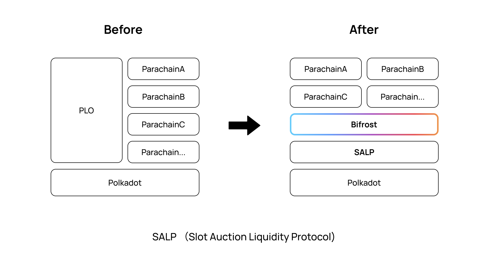
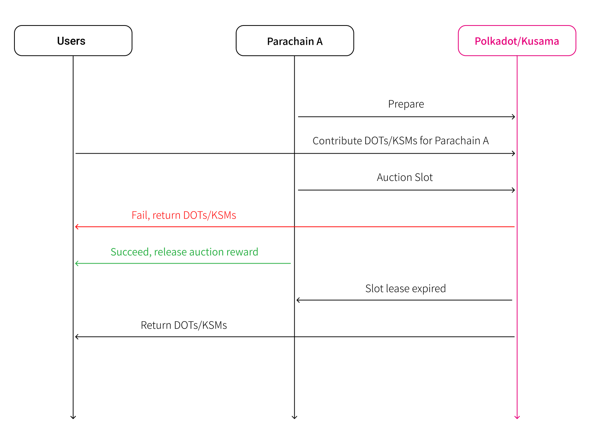
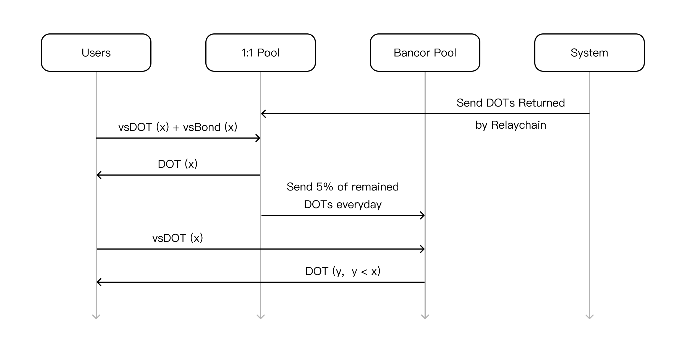

# Slot Auction 衍生品

## PLO 概述

Polkadot采取了中继链与平行链协同工作的设计方案。多个平行链共享同一个中继链提供的共识安全性。中继链能够支撑的平行链数量是有限的，某个平行链能够接入中间链运行，则必先拥有中继链的卡槽（Slot），因此Polkadot设计了PLO卡槽竞拍机制。 简单来说，平行链项目竞拍卡槽，需抵押较高额度的中继链代币（DOT/KSM），这些资金或来自于平行链项目方自身的投资，或项目方从社区中通过众筹活动募集而来。项目方通常会承诺给予社区投资者一定额度的投资回报，比如平行链自身发行的代币（ Parachain Token ）。Slot竞拍规则的具体细节，可参考：[https://wiki.polkadot.network/docs/en/learn-auction](https://wiki.polkadot.network/docs/en/learn-auction)

## 释放流动性

在为Staking机制提供流动性的同时，Bifrost也为那些与 Staking 资产质押机制具备较高相似度的经济模型提供流动性释放能力，为更多的DeFi生态应用场景贡献力量。PLO（Parachain Lease Offering）是 Polkadot 生态的关键经济模型之一，与 NPoS 的 Staking 机制有较高的可比性与相似度，是 Bifrost 优先考虑实现的业务之一。投资者直接进行 PLO 与通过 Bifrost 进行 PLO 的流程对比如下：

## 技术实现方案

从系统设计的顶层视图看，投资者用户通过Bifrost参与平行链项目的PLO众筹活动，Contribute行为会分离解耦出两类Token资产：vsToken（vsDOT/vsKSM）与vsBond。投资者贡献x个DOTs/KSMs，可获得x个vsDOTs/vsKSMs与x个vsBond。vsToken与vsBond持有者与Bifrost的交互时序图如下：

### vsBond

vsBond代表具体的平行链及其成功竞拍到的Slot。所以vsBond在命名时（vsBond-ID），会加上平行链ID与Slot租约到期日，比如：vsBond-Bifrost-2022-06-01，vsBond-ID1与vsBond-ID2是不同的数字资产。平行链可与Bifrost进行交互，查询获取 vsBond铸造者/持有者的信息，vsBond也可通过XCMP转移到对应的平行链上，由平行链自行决定采取什么样的策略与算法发放奖励给vsBond铸造者/持有者。vsBond作为权益凭证（或将vsBond看成是蕴含了投资奖励的特殊商品），并不需要高流动性交易，可通过一口价形式挂单出售，因此Bifrost系统设计有挂单售卖vsBond的机制，类似于电商平台中的C2C商品买卖市场，无需通过Uniswap/Balancer这类AMM/DEX提供交易流动性。vsBond的另一个作用是与vsToken（vsDOT/vsKSM）再结合，可以1:1的价格赎回Token（KSM/DOT） 。

### vs**Token**

和vsBond不同，所有的vsToken都是同质的，vsToken不与特定的平行链及Slot绑定。Bifrost设计了两个兑换池子：1:1承兑池、Bancor池（1:x, x &lt; 1）。具体的兑换规则如下： 1、用户同时持有vsBond-ID和vsToken，且vsBond-ID所代表的Slot租约已到期，则可参与承兑池以1:1的价格兑换出Token; 2、若用户只有vsToken，则可参与Bancor池，以1:x（x &lt; 1）的价格兑换出Token（Bancor池子中存放有Token时，用户才可正常执行兑换功能）。 3、当Slot租约到期时，Relaychain将返还Token到Bifrost，系统会将所有的Token放入1:1承兑池，然后每天从1:1承兑池的余额中抽取5%放入Bancor池。 4、若系统丢失vsBond或者某些攻击者故意囤聚vsBond而不愿意卖出，vsToken持有者仍然可以从Bancor池中兑换出Token，而不用担心vsToken不能兑付的风险。 5、系统注入到Bancor池的资金，会以线性平滑的机制逐渐释放,而不是一次性全部释放，防止vsToken与Token兑换价格不合理地大幅度波动。相当于系统在用一部分Token持续购买用户持有的vsToken。 6、只要在Bancor池中发生1:x（x &lt; 1）的兑换行为，系统（Bifrost）必然会盈利，这部分利润将进入国库,用于社区发展或回购BNC。

**Bancor算法**

为了避免计算过程中出现除数为0的情况，系统可对Balance与Supply设置初始的虚拟基值BaseBalance与BaseSupply，用户进行兑换时，将具体数额带入公式进行计算，并将所得结果减去初始基值，即可获得最终结果。如下图所示：初始的DOT虚拟基值为BaseSupply，vsDOT与DOT的价格比例为1:1；当有3\*BaseSupply（4\*BaseSupply - 1\*BaseSupply）的DOT从Bancor池中兑换掉时，vsDOT与DOT的价格比例达到2:1。系统实现时，可选取合适的BaseSupply值，以获得合适的价格曲线。

