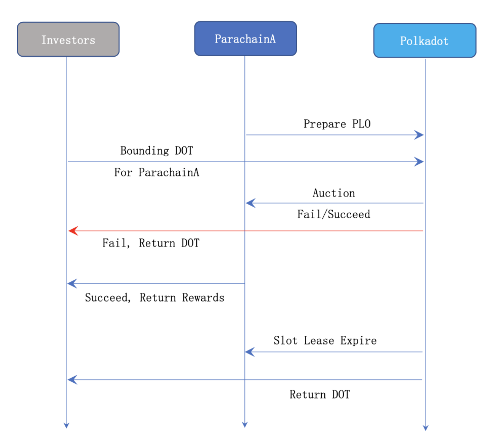

# PLO Derivative

### Project Description

Bifrost 是 Polkadot 生态的平行链和 DeFi 协议，可为抵押和抵押资产提供流动性。随着 Polkadot 与 Kusama 的发展，即将开始平行链卡槽拍卖（PLO）活动。因为平行链插槽数量有限，平行链插槽的初始价格预计昂贵，Bifrost 计划为 Kusama / Polkadot 平行链插槽拍卖提供 KSM / DOT 流动性。

### Technical solutions

在此解决方案中，Bifrost在投资者，平行链项目和Polkadot中继链之间提供了中间的抽象层，为投资者提供了更好的金融工具和灵活性，还提供了平行链项目标准化和可配置的PLO工具帮助平行链项目更好地进行卡槽竞拍，并丰富整个Polkadot社区的生态系统。

#### PLO过程中的参与者

* 投资者用户: 持有DOT, KSM 的用户，准备为某个平行链的卡槽拍卖提供Bonding支持。
* 平行链项目: 需要竞拍平行链卡槽，准备成为Polkadot和Kusama的平行链。
* Bifrost: 以去中心化的方式提供vsDOT或vsKSM衍生产品，释放卡槽拍卖锁定的DOT和KSM流动性。
* Polkadot/Kusama: 中继链，具备平行链插槽，支撑卡槽拍卖活动与平行链运行。


Bifrost团队将和潜在的平行链项目方进行沟通与合作，投资者会将DOT/KSM转账到 Bifrost平行链，并发送交易调用Bifrost-Runtime中集成的铸币函数生成vsDOT/vsKSM。Bifrost的设计目标是成为Polkadot和Kusama的平行链。Bifrost收集投资者的DOT/KSM，并代表投资者对其他平行链候选人进行投票。可以把Bifrost平行链看成是一个普通的投资者，和Alice/Bob一样，Bonding一部分资金（DOT/KSM），并对Parachain A、Parachain B...进行投票。从这个角度看，Bifrost仅仅是其他Parachain项目的Contributor，只不过Bifrost的资金由其他投资者存入。铸币时将同时生成vsDOT/vsKSM和vsBond-XXX，vsDOT是同质的，vsKSM也是同质的，但不同时期、不同平行链对应的vsBond是不同质的。当ParachainA的插槽到期时，中继链会将一部分DOT/KSM返回给Bifrost，任意用户持有vsDOT/vsKSM和vsBond-A将可赎回对应的DOT/KSM。若一个用户只有vsDOT/vsKSM，但是没有vsBond-A，他将不能执行赎回操作，但他可选择卖掉vsDOT/vsKSM，或购买vsBond-A，然后执行赎回操作。Bifrost 团队并没有权限控制投资者用户转移过来的DOT/KSM，这些资金将由Bifrost的运行时代码自动化/去中心化地保管和控制。用户持有vsBond-A，等到ParachainA做为平行链正常运行时，将获得ParachainA项目给予的奖励，由ParachainA团队负责处理。在Bifrost Runtime中，集成有Balancer DEX模块，以及Zenlink等第三方模块，vsToken\(vsDOT/vsKSM\)将在这些DEX中进行交易。Bifrost的核心目标是为PLO与Staking提供流动性，同时也计划集成其他的DEFI应用到自己的生态环境中，vsToken与vToken，以及vsBond将会运行在这些DEFI应用中。

#### **技术实现**


  
投资者用户通过 Bifrost 参与平行链项目的 PLO 活动，Bounding 行为会分离解耦出两类 Token：vsToken与 vsBond。vsBond 可通过XCMP转移到对应的平行链上，然后由该平行链按照自己设计的方式发放奖励给持有者，所以可将 vsBond 看成是蕴含了投资奖励的特殊商品。Bifrost系统设计两个池子：1:1承兑池、1:x（x &lt;= 1）Bancor池。用户同时持有 vsBond 和 vsToken，且 vsBond 所代表的 Slot 租约已到期，则可参与承兑池以1:1的价格兑换出 Token，若用户只有 vsToken，则可参与 Bancor 池，以1:x（x &lt;= 1）的价格兑换出 Token。只有当池子中存放有 Token 时，用户才可正常执行兑换功能。当 Slot 租约到期时，Relaychain 将返还 Token 到 Bifrost，系统会将所有的 Token 放入承兑池，然后每天从承兑池的余额中抽取5%放入 Bancor池。若系统丢失 vsBond 或者某些攻击者故意囤聚 vsBond 而不愿意卖出，vsToken 持有者仍然可以从 Bancor 池中兑换出 Token，而不用担心 vsToken 不能兑付的风险。系统注入到 Bancor 池的资金，会以线性平滑的机制逐渐释放,而不是一次性全部释放，这样设计可以防止 vsToken 与 Token 兑换价格不合理地大幅度波动。这其实就相当于系统在用一部分 Token 持续购买用户持有的 vsToken。只要在 Bancor 池中发生1:x（x &lt;= 1）的兑换行为，Bifrost 系统必然会盈利，这部分利润将进入国库,用于社区发展或回购 BNC。vsBond 作为权益凭证，不需要高流动性交易，通过一口价形式挂单出售即可，因此 Bifrost 系统设计有挂单售卖 vsBond 的机制，类似于电商平台中的 C2C 商品买卖市场，无需通过 Uniswap/Balancer 这类 AMM/DEX 提供交易流动性。

#### 工作流程

* 投资者参与 PLO 卡槽拍卖的原始流程（失去流动性）

* 投资者通过 Bifrost  参与 PLO 卡槽拍卖的流程（释放流动性）

