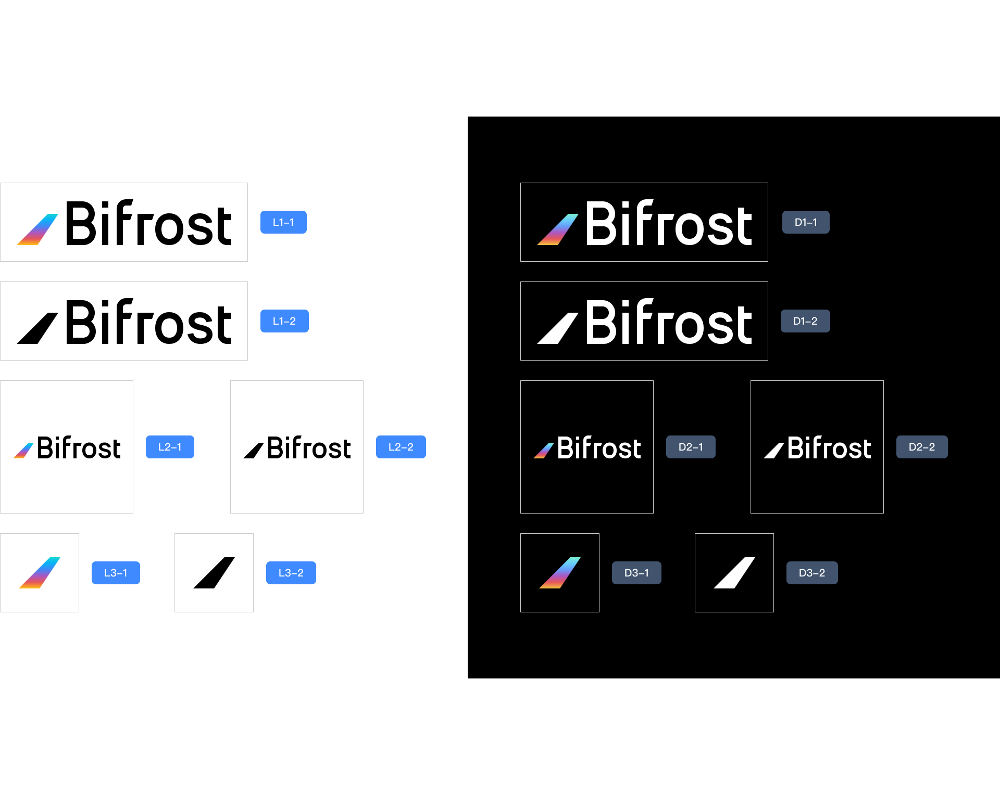
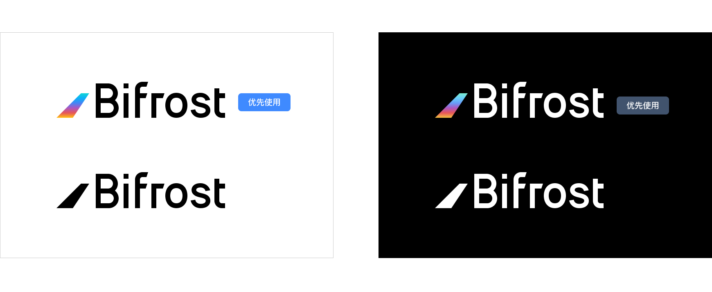
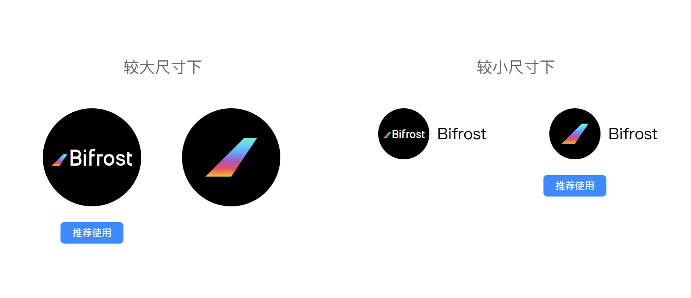
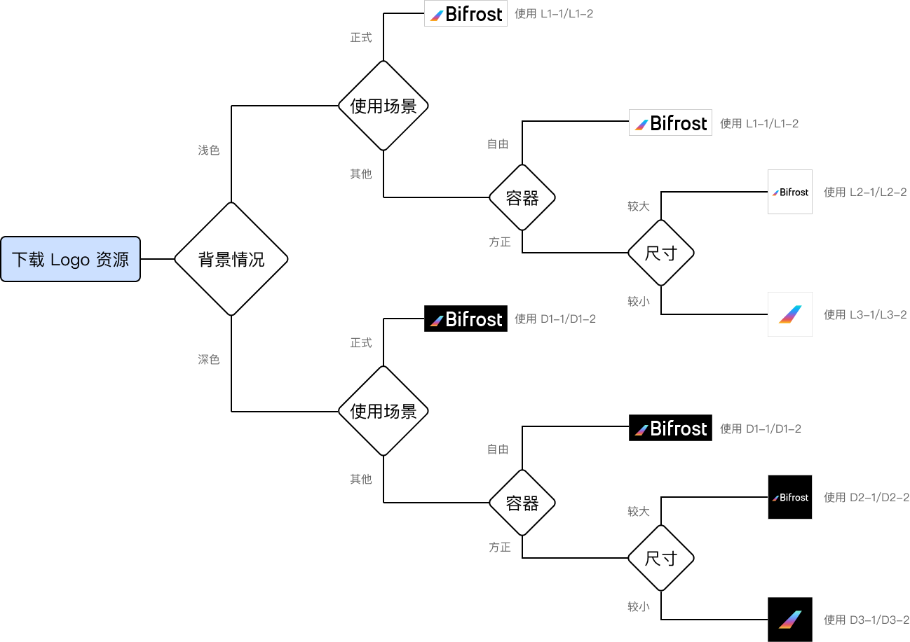

# 商标资源

### 品牌资源

#### Logo资源包

[下载](https://github.com/bifrost-finance/design-assets/raw/master/brand/Bifrost-Logo-Assets.zip)

#### 使用说明

**含义和组成**

Bifrost 的 Logo 由图形和文字两部分组成，图形部分蕴意彩虹桥的抽象意向，文字部分为 Bifrost 的标准字母字体

**组合**

**安全区**

在 Logo 的使用过程中要时刻保证安全区内没有其他元素的干扰

**应用场景**

**关于颜色的选择**

在白色/浅色背景下，优先使用「彩色图形-黑字」Logo，也可使用纯黑 Logo。在黑色/深色背景下，优先使用「彩色图形-白字」Logo，也可使用纯白 Logo

**关于图形的选择**

在正式场合（如官方海报、合作宣传、正式通告等）请务必使用「图形+文字」的完整 Logo

其他一些场景下（如：项目头像、宣传图片、社交媒体图等），既可以使用完整 Logo 也可根据实际需要使用「单独图形 Logo」。当展示区域为类似 1：1 的方形/圆形区域，展示尺寸相对较小的情况下，如果有明确的文字体现 Bifrost，Logo 部分推荐使用「单独图形 Logo」

**快速选用**

