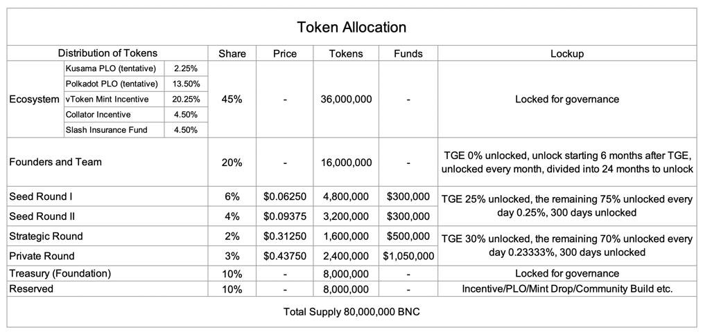

# Token 分配情况

## 社区活动分发的BNC 记录

### 2021年第一季度

#### **1.** How to participate in Bifrost vETH Mint Drop between Polkadot Eco and Ethereum Layer 2?

**BNC 分发情况:** [https://docs.google.com/spreadsheets/d/1RoffOJmgCyhCT0OEUdYB44Kc9Onn5Gnj61mUqoQzQMM/edit?usp=sharing](https://docs.google.com/spreadsheets/d/1RoffOJmgCyhCT0OEUdYB44Kc9Onn5Gnj61mUqoQzQMM/edit?usp=sharing)

#### 2. Why Parachain Slot Auctions Are Worth the Wait

**BNC 分发情况:** [https://docs.google.com/spreadsheets/d/1L9dDnT8mDnjcseOaugIHExvUu-GtiEPQrrCnQlZgpWw/edit?usp=sharing](https://docs.google.com/spreadsheets/d/1L9dDnT8mDnjcseOaugIHExvUu-GtiEPQrrCnQlZgpWw/edit?usp=sharing)

