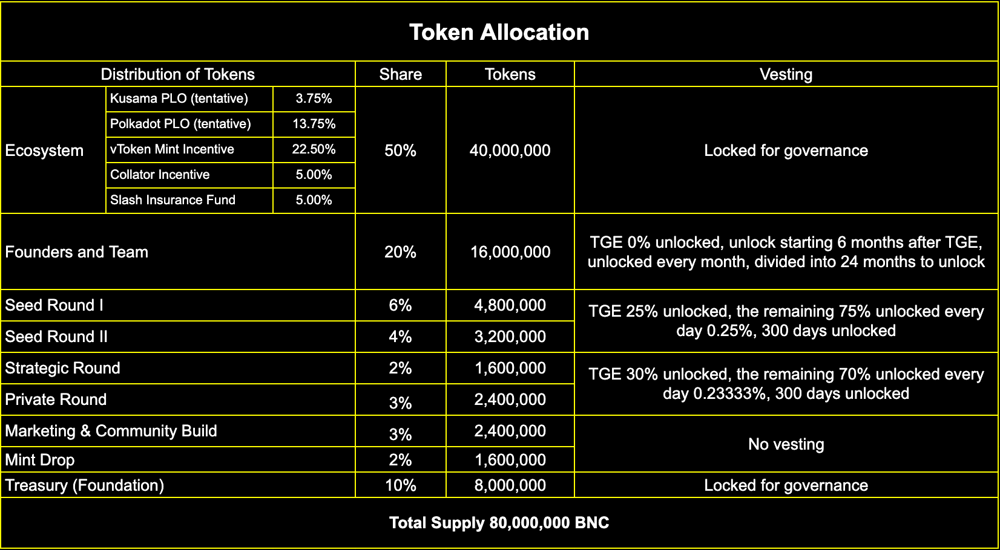

# Token 分配情况

## BNC 分配结构

## 社区活动分发的BNC 记录

### 2021年第一季度

#### 1.vETH Mint Drop 1

#### BNC 分发情况: [https://docs.google.com/spreadsheets/d/1ogI2roisjQyKm\_Jh6AV7qpa5l662H-mPtu4URj2zPFw/edit?usp=sharing](https://docs.google.com/spreadsheets/d/1ogI2roisjQyKm\_Jh6AV7qpa5l662H-mPtu4URj2zPFw/edit?usp=sharing)

####

#### 2.Zenlink x Bifrost Airdrop

**BNC 分发情况:  **[https://docs.google.com/spreadsheets/d/1t\_uUxpfLRUDSsgzPvuOv7TChe2-280y4hDrdKA4TZgQ/edit?usp=sharing](https://docs.google.com/spreadsheets/d/1t\_uUxpfLRUDSsgzPvuOv7TChe2-280y4hDrdKA4TZgQ/edit?usp=sharing)

#### **3. **How to participate in Bifrost vETH Mint Drop between Polkadot Eco and Ethereum Layer 2?

**BNC 分发情况: **[https://docs.google.com/spreadsheets/d/1RoffOJmgCyhCT0OEUdYB44Kc9Onn5Gnj61mUqoQzQMM/edit?usp=sharing](https://docs.google.com/spreadsheets/d/1RoffOJmgCyhCT0OEUdYB44Kc9Onn5Gnj61mUqoQzQMM/edit?usp=sharing)

#### 4.Bifrost Meme Contest

**BNC 分发情况: **[https://docs.google.com/spreadsheets/d/1t0xn9KLcZtCRxNLf8thJJqAngVcu3u0e6JTvT89nwpk/edit?usp=sharing](https://docs.google.com/spreadsheets/d/1t0xn9KLcZtCRxNLf8thJJqAngVcu3u0e6JTvT89nwpk/edit?usp=sharing)

#### 5.Russian Community New Year Event

**BNC 分发情况: **[https://docs.google.com/spreadsheets/d/16t92Bl8bcW7pWFHnMnomkAwgukiklBmD2emDWQ1II9M/edit?usp=sharing](https://docs.google.com/spreadsheets/d/16t92Bl8bcW7pWFHnMnomkAwgukiklBmD2emDWQ1II9M/edit?usp=sharing)

#### 6. Why Parachain Slot Auctions Are Worth the Wait

**BNC 分发情况: **[https://docs.google.com/spreadsheets/d/1L9dDnT8mDnjcseOaugIHExvUu-GtiEPQrrCnQlZgpWw/edit?usp=sharing](https://docs.google.com/spreadsheets/d/1L9dDnT8mDnjcseOaugIHExvUu-GtiEPQrrCnQlZgpWw/edit?usp=sharing)

#### 7.DeFi Go Community AMA

**BNC 分发情况:          **[https://docs.google.com/spreadsheets/d/1YhHaj2uZ3ALipxVxe-ML5XW70yD7ZZXvbN0NAQg0pCk/edit?usp=sharing](https://docs.google.com/spreadsheets/d/1YhHaj2uZ3ALipxVxe-ML5XW70yD7ZZXvbN0NAQg0pCk/edit?usp=sharing)

#### 8. vETH Mint Drop 2

#### **BNC 分发情况:  **[https://docs.google.com/spreadsheets/d/1p43e453R9uvVduF\_ROezwjQyHl8r\_7a5WH9e-QdEHK0/edit?usp=sharing](https://docs.google.com/spreadsheets/d/1p43e453R9uvVduF\_ROezwjQyHl8r\_7a5WH9e-QdEHK0/edit?usp=sharing)

#### 9. Bifrost x Plasm at PolkaWarriors AMA

**BNC 分发情况: **[https://docs.google.com/spreadsheets/d/1\_CscFJPCDCtvVlSVQf5EWEKt3FGsjbb7BxO9fxmYujc/edit?usp=sharing](https://docs.google.com/spreadsheets/d/1\_CscFJPCDCtvVlSVQf5EWEKt3FGsjbb7BxO9fxmYujc/edit?usp=sharing)

#### 10. Tuoluo Finance AMA

**BNC 分发情况: **[https://docs.google.com/spreadsheets/d/1FntagvswsmLj5siznOBBlH6dWjsJ9Li0kBVjcZMAV0M/edit?usp=sharing](https://docs.google.com/spreadsheets/d/1FntagvswsmLj5siznOBBlH6dWjsJ9Li0kBVjcZMAV0M/edit?usp=sharing)

#### 11. PolkaWorld AMA

#### **BNC 分发情况: **[https://docs.google.com/spreadsheets/d/1uHw7kEPNWy9HZqibgsMTFyIUzPvq\_Jd3nbOcCVEZudc/edit?usp=sharing](https://docs.google.com/spreadsheets/d/1uHw7kEPNWy9HZqibgsMTFyIUzPvq\_Jd3nbOcCVEZudc/edit?usp=sharing)

#### 12. vETH Hold Airdrop

**BNC 分发情况:  **[https://docs.google.com/spreadsheets/d/1AZ1gMmpopbJMShQFXrJeEHX533Z3miTwYcQUIeUnGx0/edit?usp=sharing](https://docs.google.com/spreadsheets/d/1AZ1gMmpopbJMShQFXrJeEHX533Z3miTwYcQUIeUnGx0/edit?usp=sharing)

#### 13. vETH Liquidity Mining on DODO 1

**BNC 分发情况: **[https://docs.google.com/spreadsheets/d/1LVgbV\_WNMwIJ\_ax3tucM1o7adQzv\_t-LtUxGFbJrn5w/edit?usp=sharing](https://docs.google.com/spreadsheets/d/1LVgbV\_WNMwIJ\_ax3tucM1o7adQzv\_t-LtUxGFbJrn5w/edit?usp=sharing)

### 2020年第二季度

#### 1. How to balance liquidity and high yield with the new Staking + DeFi play?

**BNC 分发情况: **[https://docs.google.com/spreadsheets/d/18VJJBydaWe8hKKFmd4YFWYhozJCGnVrH92j6fl0uQpo/edit?usp=sharing](https://docs.google.com/spreadsheets/d/18VJJBydaWe8hKKFmd4YFWYhozJCGnVrH92j6fl0uQpo/edit?usp=sharing)

#### 2. Polkadot Ecoproject Bifrost, a new scenario for cross-chain extension Staking

**BNC 分发情况: **[https://docs.google.com/spreadsheets/d/19S3FHhz8d\_L0oel1Hf7t3TNDtcog8tQZstrcrBsjUEY/edit?usp=sharing](https://docs.google.com/spreadsheets/d/19S3FHhz8d\_L0oel1Hf7t3TNDtcog8tQZstrcrBsjUEY/edit?usp=sharing)

####

#### **3. **Private Sharing Session of Polkadot Project Parties: Can Polkadot Become the Next Ethereum?

**BNC 分发情况: **[https://docs.google.com/spreadsheets/d/1OGBJpud7ebtYcM1xOQw5Ns1yEmgOxDorqu4fUsX1zVk/edit?usp=sharing](https://docs.google.com/spreadsheets/d/1OGBJpud7ebtYcM1xOQw5Ns1yEmgOxDorqu4fUsX1zVk/edit?usp=sharing)

****

#### 4. Polkadot Ecoproject Bifrost, the new pioneer in POS mining  &#x20;

**BNC 分发情况: **[https://docs.google.com/spreadsheets/d/1SsCil3FhqU1K2dItZKdbCJY0eH4iJ6kpWPjO2sUaDbg/edit?usp=sharing](https://docs.google.com/spreadsheets/d/1SsCil3FhqU1K2dItZKdbCJY0eH4iJ6kpWPjO2sUaDbg/edit?usp=sharing)

### 2020年第三季度

#### **1. **How to implement Defi & Staking with Bifrost?

**BNC 分发情况:               **[https://docs.google.com/spreadsheets/d/13zMAeIJ9qNmmBtn-nRIwZxp6aehmBjRMVDwVBizNXbg/edit?usp=sharing](https://docs.google.com/spreadsheets/d/13zMAeIJ9qNmmBtn-nRIwZxp6aehmBjRMVDwVBizNXbg/edit?usp=sharing)

#### **2. **Bifrost Across PoS Consensus and DeFi

**BNC 分发情况: **[https://docs.google.com/spreadsheets/d/1F8BhdwQ8vh1U8GXcpO9StoazY-uC8\_Zv\_FCqIyyfHUg/edit?usp=sharing](https://docs.google.com/spreadsheets/d/1F8BhdwQ8vh1U8GXcpO9StoazY-uC8\_Zv\_FCqIyyfHUg/edit?usp=sharing)

****

**3. Weibo Event **

**BNC 分发情况: **[https://docs.google.com/spreadsheets/d/1VZyclOndF7aqm3mvUH5BjBFdoLKesIL7TQBEJ06-LjM/edit?usp=sharing](https://docs.google.com/spreadsheets/d/1VZyclOndF7aqm3mvUH5BjBFdoLKesIL7TQBEJ06-LjM/edit?usp=sharing)

### 2020年第四季度

#### **1. **Polkadot Treasures Project - A Closer Look at the Bifrost TestNet and Project Development Path

**BNC 分发情况: **[https://docs.google.com/spreadsheets/d/1IhrBRCqVuEQmsgLPDk6cf0Xb\_eiW-sh0LOhKVVmXxfc/edit?usp=sharing](https://docs.google.com/spreadsheets/d/1IhrBRCqVuEQmsgLPDk6cf0Xb\_eiW-sh0LOhKVVmXxfc/edit?usp=sharing)

**2. Bifrost Telegram AMA**

**BNC 分发情况 : **[https://docs.google.com/spreadsheets/d/1yx1MkfS2BeBSNUTkBuvvB30bQrbHOglrbOeyApt89qY/edit?usp=sharing](https://docs.google.com/spreadsheets/d/1yx1MkfS2BeBSNUTkBuvvB30bQrbHOglrbOeyApt89qY/edit?usp=sharing)

#### 3. PolkaNight Offline Event

**BNC 分发情况 : **[https://docs.google.com/spreadsheets/d/1C7k8SLVuKNdG8DU8bDQDWh1SuWgjBICe1CyNFfQN-3k/edit?usp=sharing](https://docs.google.com/spreadsheets/d/1C7k8SLVuKNdG8DU8bDQDWh1SuWgjBICe1CyNFfQN-3k/edit?usp=sharing)

#### 4. Web3 Conference and Wanxiang Blockchain Week Review What's New at Bifrost

**BNC 分发情况: **[https://docs.google.com/spreadsheets/d/18WKe7OOc9b9S9YfpxY03HdxXrL1ljQg2x30bKqMK7\_A/edit?usp=sharing](https://docs.google.com/spreadsheets/d/18WKe7OOc9b9S9YfpxY03HdxXrL1ljQg2x30bKqMK7\_A/edit?usp=sharing)

#### 5. How to get Staking rewards in ETH 2.0 without locking-up

**BNC 分发情况: **[https://docs.google.com/spreadsheets/d/1nOvkOoMOi7wvdwQjUWUNXeetSAeuiEtqSQFy1aJupUI/edit?usp=sharing](https://docs.google.com/spreadsheets/d/1nOvkOoMOi7wvdwQjUWUNXeetSAeuiEtqSQFy1aJupUI/edit?usp=sharing)

#### 6. Hoo & Bifrost Telegram AMA

**BNC 分发情况:**

#### 7. Candy Theme AMA-Polkadot

**BNC 分发情况: **[https://docs.google.com/spreadsheets/d/1NaycwqBxJqnowfCY9reiKlQWy3Yk-cypI5IJrsO-Tjg/edit?usp=sharing](https://docs.google.com/spreadsheets/d/1NaycwqBxJqnowfCY9reiKlQWy3Yk-cypI5IJrsO-Tjg/edit?usp=sharing)

