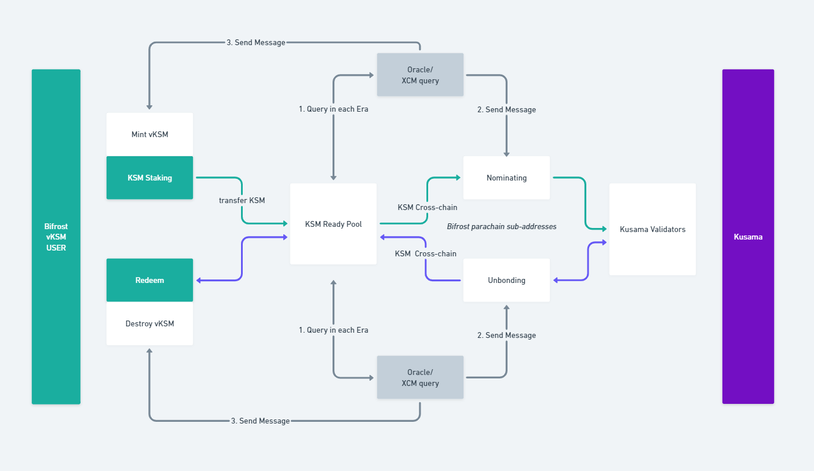

# vKSM

## **What is vKSM?**

**vKSM (voucher KSM) is a shadow token of staked KSM, with fully underlying KSM reserve and yield-bearing feature of KSM staking reward.** Users can deposit KSM into Bifrost SLP protocol and get vKSM as return, vKSM can be traded in the open market or be redeemed back to KSM. Holding vKSM equals to holding the KSM staking position, staking rewards appreciate the exchange price of vKSM.


Staking rewards automatically add to the vKSM exchange price, no manual claim. The longer vKSM postion holding, the greater amount of KSM will be exchanged back for redemption.


## Why vKSM?


**Liquid Staking**


The product allows users to stake KSM for liquid vToken, (vKSM). vKSM will keep receiving **staking rewards** and can continue to be used in Bifrost and Kusama-based DeFi for additional rewards.


**Automatically Staking rewards capturing without scenario limitations**


SLP will issue Staking rewards to vKSM by adjusting the price of vKSM / KSM upwards. vKSM Rate = SLP Staking KSM (SUM) / vKSM Total Issuance.


**Floating redemption period, vKSM redemption ≤ 7 days**


While Kusama’s original chain Staking has a **fixed 7-day redemption period**, Bifrost SLP helps users to realize the possibility of early vKSM redemption by matching the real-time vKSM minting quantity with the redemption quantity at the protocol layer in the form of a queue. Theoretically, it can achieve second-level redemption.


**Higher Staking Yield**


In the SLP protocol, the protocol screens more than **10 verified nodes** through governance (subsequently increasing with the overall staking volume) and adds multiple filters such as the **number of nominees**, **commission ratio**, and **history of blocks out to maximize the return of this verifier portfolio** while ensuring that none of the nodes have experienced slashes.


**Multi-environment Compatibility**


vKSM is one of Substrate assets in Bifrost parachain, by using the [HRMP](https://wiki.polkadot.network/docs/learn-crosschain#xcmp-cross-chain-message-passing) channels between Bifrost and others, it can be easily utilized in EVM, WASM and Substarte competiable parachains.

## How it works?

vKSM is minted by Bifrost SLP pallet, so firstly users have to call XCM cross chain transfer KSM from Kusama Relay to Bifrost Parachain.

### Mint vKSM

1. Users initiate a vKSM mint order, SLP protocol transfers KSM to KSM Ready Pool (which is an order pool accumulates all mint and redeem orders), SLP mints vKSM for users;
2. KSM Ready Pool matches Mint amount and Redeem amount;
3. Oracle monitor matching results from KSM Ready Pool and send messages to Kusama Bifrost parachain sub-addresses;
4. Parachain sub-addresses execute Staking to SLP Kusama validators set, Oracle queries the successful messages and send them back to Bifrost KSM Ready Pool, get ready for the next matching.

### Redeem vKSM

1. Users initiate a vKSM redeem orders to KSM Ready Pool;
2. KSM Ready Pool matches Redeem amount and Mint amount, and dispatches the remaining KSMs to vKSM redeem orders, SLP destroys the redeemed vKSM amount;
3. Oracle monitor redeem orders from Bifrost chain and send messages to Kusama Bifrost parachain sub-addresses;
4. Parachain sub-addresses execute Redeem to SLP Kusama validators set and send redeemed KSM back to Bifrost parachain, Oracle queries all these messages and send them back to Bifrost KSM Ready Pool, get ready for the next matching.

### KSM Reward

The KSM reward will be reinvested on the relay chain, and the Oracle will transmit the reward data to the KSM Ready Pool to adjust the vKSM exchange rate.

$$
vKSMrate=(StakedKSM+StakingReward)/vKSM Allocation
$$

💡 Read more detailed info in the following sections.

***

## SLP-vKSM Architecture

### **Glossary**

#### KSM Ready Pool

The operation of staking and the settlement of related operations are generally not subject to real-time settlement, and there will be a cycle, which is [Era in Kusama](https://wiki.polkadot.network/docs/kusama-parameters#periods-of-common-actions-and-attributes). In order to improve resource efficiency and utilization, the **KSM Mint and Redeem requirements with related requirements are stored through the KSM Ready Poo**l. Wait until the appropriate time for unified processing.

#### Multi-sign Oracle

What actions are performed by the SLP module on the Bifrost chain, the settlement of exchange rates, etc., all need to obtain accurate relay chain data. Through multisig oracles, Kusama's on-chain data can be fed to the Bifrost chain on a regular basis or under certain circumstances, so as to keep the SLP module running normally. The accuracy and authenticity of the data is the key to the security of the SLP protocol. In the future, **this part of the function should be implemented through XCM query**. At present, a more mature multi-signature scheme is used for the time being.

Oracle Multisig Address

1. bjbwPTJoPdtF96S2FEquuHoNv72T6KPzhayntu17Cr5g4BX
2. cEDk5LZS5UQtEEJnv1Sm1pDoTCDvv6rmChyF4A81sT9eCUZ
3. djJJCvG3s2Y4qZeTDS6RmmWdFSBHvcfTyJEDb2ARZKma9zA
4. eznovZYddE1KAvMc3ooBhvSS3JY6xFbii3QUCqpVEdnx5eg
5. gQCMN389RSi4gZwbG25agpyMPp1KQfPetteRU8TRd8tiQHu

Multisig synthetic address: emmdmYNhx3PMyuaQZi98ZSNPw6PhFnhGnXyX2NqLwWazck2

#### Aggregator Module

In order to improve the user experience of Redeem (more use of Swap for lightning swaps), this module is used to AMM (automatic market-maker) behavior and **simulate arbitrage to lower vKSM's Swap discount rate to a level similar to Redeem**. The profits generated in the process continue to carry out relevant market making operations/return to users. Through this module, the system can generate additional value to promote the healthy development of the SLP module.

#### Kusama Staking Era

The settlement cycle of Kusama staking operation is every 6 hours. At the end of the cycle, the **bonding / Unbonding operation** performed in the current cycle will be confirmed, and the **staking reward will be settled**. Committing operations at the end of the cycle is most efficient because the efficient execution of most operations in the cycle is processed uniformly at the end of the cycle.

#### Bifrost SLP Address

The KSM pledged by SLP and the related state are managed through the **sub-account of the parachain address**. Since there is an upper limit on the amount of KSM that can be pledged by an address under the condition of maximizing revenue, it should have the ability to configure multiple sub-addresses through on-chain governance.

#### vKSM Rate

SLP needs to issue Staking rewards to vKSM by raising the price of vKSM / KSM, **vKSM Rate = Staking total KSM / vKSM total issuance**. This exchange rate is the basis for a large number of operations of the system.

### How KSM Ready Pool works? (Adjusting vKSM Ratio)

KSM Ready Pool communicate with Oracle by receiving update status and data on Kusama relay-chain in each Era.

#### In a New Era

When a new Era message is received by SLP, the system mainly performs the following operations:

* Send the cross-chain message withdraw Unbonded KSM and cross-chain transfer it to the KSM Ready Pool
* Get the new staking reward data in current era, a part of which is directly transferred to the Aggregator module across the chain according to the Bifrost service commission rate.
* After confirming that all current operations are successful, end the operation and issue a completion event

#### In the End of an Era

After receiving the Era End message, the system performs the following operations in sequence:

* Match Redeem demand orders one by one for KSM redemption in the order of submission, delete the redeemed demand orders, and transfer KSM back to the corresponding address (Redeem orders support partial redemption)
* When the Redeem match is over, judge the current KSM Ready Pool status:


**Redeem:** vKSM revoking request on Bifrost side. \
**Unbond:** KSM revoking request on Kusama side. \
**Rebond:** cancel KSM unbonding.


| KSM has leftovers                                                                                   | Initiate a cross-chain request to bond more funds with the remaining KSM on the relay chain          |
| --------------------------------------------------------------------------------------------------- | ---------------------------------------------------------------------------------------------------- |
| All KSMs have been matched, and the relay chain Unbonding state KSM ≥ Redeem demand order KSM total | Initiate a cross-chain request to Rebond funds (Unbonding state KSM - Redeem demand list sum KSM )   |
| All KSMs have been matched, and the relay chain Unbonding state KSM < Redeem demand order KSM total | Initiate a cross-chain request to Unbond funds (Redeem demand list total KSM - Unbonding status KSM) |

* Calculate the current vKSM Rate = Staking KSM (SUM) / vKSM total issuance and update the record
* After confirming that the above operations are successfully executed, end the current Era operation and wait for the next cycle to start

### The Workflow of Aggregator Module

.png>)

#### 1. Check the KSM/vKSM exchange rate in Zenlink DEX

Get the exchange rate of KSM/vKSM in the DEX by query between modules at the end of the block.

#### 2. Calculate and construct the transaction

Based on the comparison between the queried DEX exchange rate and vKSM Rate, when the exchange rate in DEX < vKSM Rate, a transaction is triggered, and the transaction is constructed based on the number of KSMs existing in the current Aggregator Module, so that the DEX exchange rate after the transaction ≈ vKSM Rate. Initiate a transaction to get a discounted vKSM.

#### 3. Determine whether to redeem vKSM

The remaining KSM in the current module + the Redeem value requested by the current module < the set arbitrage loop maximum value (the arbitrage loop maximum value can be set and modified by governance). Then perform the Redeem operation on the newly acquired vKSM in the module (KSM Ready Pool will immediately process the Redeem order submitted by the Aggregator first)

#### 4. Excess vKSM is flushed into the liquidity pool

When the remaining KSM in the current module + the Redeem value requested by the current module > the set arbitrage cycle maximum value, vKSM will no longer be redeemed, but half of the balance of vKSM and KSM will be directly flushed into DEX's KSM - vKSM In the liquidity pool of the trading pair, obtain LP Token.

## vKSM Validator Set

## Selecting Conditions

There are several filters to select vKSM Validators:

* Validator address with on-chain identity
* No experienced Slashes
* Low commission
* Total Stake below average number
* Average Return Rate in 7 days
* Available nominator slot

## Selecting Organization

The selecting organization will evolute in 3 stages:

1. Bifrost Team&#x20;
2. Bifrost Council&#x20;
3. SLP automatic selection (current stage)

Validator selecting or replacement is a automatic process, it depends on a score ranking which is socred by a script:

****[**Validator Score Ranking**](https://docs.google.com/spreadsheets/d/13YdCMc\_bVdmy5My22mWRTC5ITwVEaRZQi4fIZGr8tSw/edit#gid=628365504)****

****[**The Script**](https://bifrost-api-test.vercel.app/api/dapp/staking/\_refresh)****

## Current Validator Set

Check for live Validator Set:

vKSM: [https://bifrost.app/vstaking/vKSM?tab=validators](https://bifrost.app/vstaking/vKSM?tab=validators)
