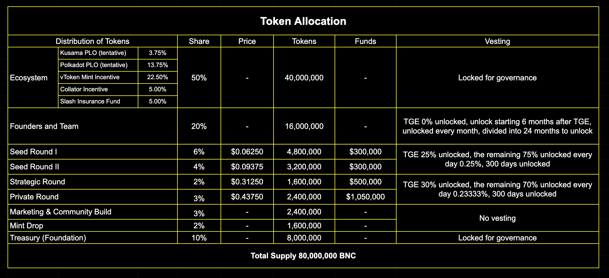

# Bifrost Native Coin \(BNC\)

Bifrost Native Coin \(BNC\) is the main net Token of Bifrost, the initial total supply is 80000000. 
The goal of BNC distribution is to make the Bifrost network more decentralized, build the market size of staking derivatives vToken, and incentivize the liquidity market of staking derivatives vToken. Every aspect of BNC distribution is critical to the healthy development of the Bifrost Agreement and its ecosystem.

## Value Capture

* **Liquidity commission for derivatives:** Transfer, transaction, mortgage and other behaviors in Bifrost network all need to pay a certain commission to maintain the network. BNC that used to pay commission will be sent to the Treasury for further administration and distribution. \(All kinds of tokens can pay commission\)
* **Slash collateral:** Participating nodes will be required to pledge part of BNC to obtain votes from the asset of Staking pool, while increasing the cost of Slash. Slash collateral will be increased or decreased based on the node's performance score.
* **Governance Voucher:** BNC can be used on on-chain parliament, technical committee, Treasury allocation, referendum governance, node election and other chain governance functions, hold BNC can get a right in Bifrost network governance.
* **Capture of Staking Reward:** Part of the Staking reward generated from Bifrost will be used for BNC repurchase and put into the State Treasury.

## Incentive Model

Reserved part and funds may be adjustable with the development of Bifrost, but Bifrost will not make a zero-cost airdrop and any incentive will satisfy the principle of fundamental value capture.
  50% of the tokens are reserved as incentives for the entire ecosystem to ensure that the Bifrost network can be implemented and can continue to operate in a healthy manner. Including vToken minting \(incentive\), PLO slot auctions, Collator incentive, Slash insurance.

* **vToken Minting Incentive:** vToken liquidity is the most significant value that Bifrost can offer, 22.5% of the TOTAL BNC being used to reward users who mint vToken.
* **PLO \(Parachain Lease Offering\):** Successful PLO symbolizes measureless value to Bifrost network. Bifrost will release 17.5% Token in total to reward the group that helps Bifrost to participate in the PLO.

## Distribution and Unlocking

In order to ensure the development of Bifrost's function, launch and ecosystem development, different parts of the BNC allocation will have different proportions of lock-up time, and the allocation for the BNC team will also be linearly unlocked 180 days \(half a year\) after Day0 \(circulation day\), and continue Unlocked in two years.

